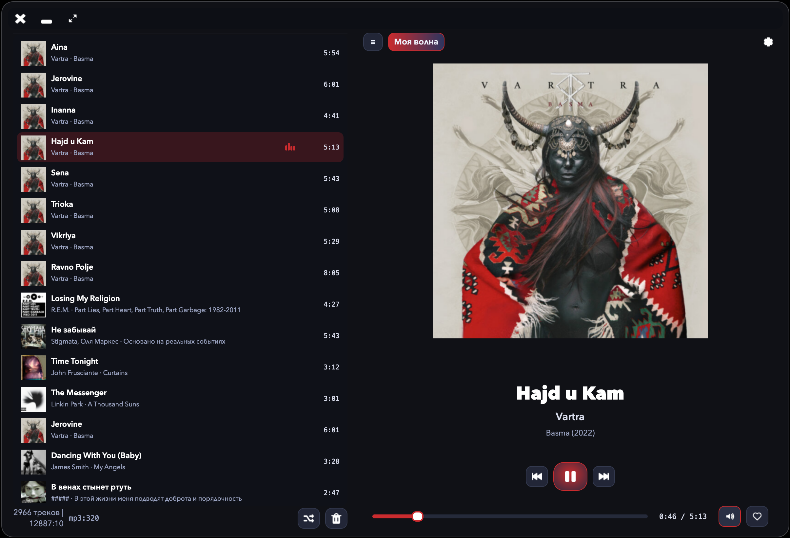
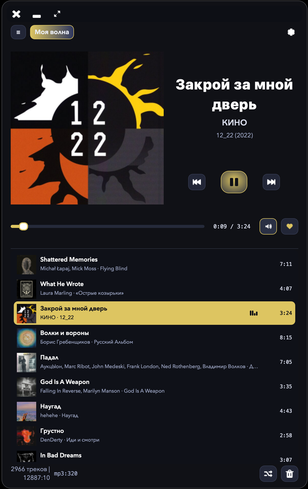
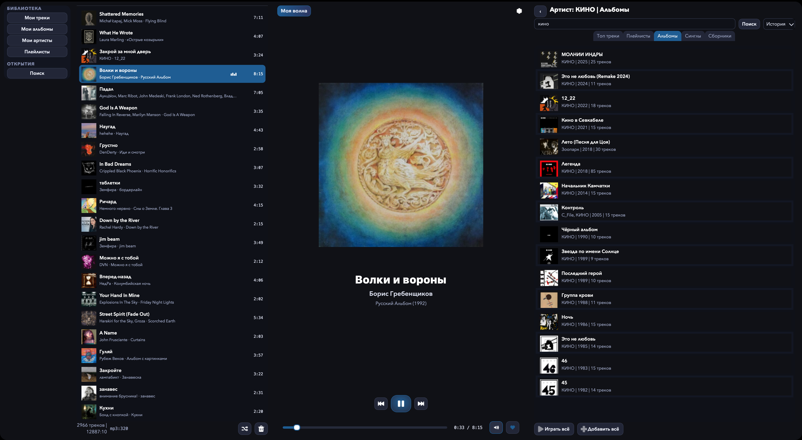

# YaYmp

`YaYmp` — YetAnotherYandexMusicPlayer неофициальный десктопный клиент для Яндекс Музыки.
Основная причина его существования - оно потребляет значительно меньше cpu/gpu чем официальное приложение.
Дополнительная причина - попытка реализовать "классический" интерфейс плеера с плейлистом.

## Важно

- Это **не официальный клиент** Яндекс Музыки.
- Официальный клиент доступен здесь: <https://music.yandex.ru/download/>
- Приложение **не позволяет скачивать музыку** и не ставит перед собой такой цели.
- Приложение для работы требует подписку яндекс плюс, **не позволяет слушать музыку без подписки** и не ставит перед собой такой цели.
- Windows-поддержка сейчас ориентирована на Windows 11 x64.
- Для Windows публикуются два артефакта: `portable zip` и installer.

## Зачем это сделано

Основная цель проекта — сделать приложение, которое:

- ощущается как обычный лёгкий desktop-плеер;
- меньше нагружает систему, чем официальный клиент;
- визуально проще устроено;
- остаётся удобным для базового ежедневного прослушивания.

Проект **не** пытается добиться полного паритета по возможностям с официальным клиентом. Такой цели нет и не будет.

## Основные возможности

- поиск по каталогу Яндекс Музыки;
- воспроизведение треков, альбомов и плейлистов;
- `My Tracks`, `My Albums`, `My Artists`, плейлисты и `My Wave`;
- очередь воспроизведения с shuffle / repeat;
- лайки для треков, альбомов, артистов и плейлистов;
- телеметрия воспроизведения и улучшенная работа `My Wave` / station-flow;
- опциональный `Waveformed Progress`:
  - выключен по умолчанию;
  - при включении показывает waveform + buffered/download progress прямо в seek bar;
  - на Windows отсутствует и возвращать его пока не планируется;
- переключение темной/светлой темы, языка интерфейса и стиля оформления;
- системная интеграция:
  - macOS Now Playing / media keys;
  - Linux MPRIS;
  - Windows SMTC/media keys + track change toasts;
- сборки для macOS, Linux и Windows через Nuitka.

## Скриншоты

<p>
  
</p>

<p>
  
</p>

<p>
  
</p>

## Основные библиотеки и компоненты

Проект в первую очередь опирается на:

- `PySide6` — интерфейс на Qt Widgets;
- `python-mpv` + `libmpv` — воспроизведение;
- `yandex-music` — Python-библиотека для доступа к Яндекс Музыке;
- `platformdirs` — платформенные директории для конфигов, данных, кеша и логов;
- `pyobjc` — интеграция с системными API на macOS;
- `Nuitka` — сборка self-contained desktop-бандлов.

Отдельно важно:

- этот репозиторий **не связан** с авторами библиотеки `yandex-music`;
- проект также **не связан** с Яндексом и Яндекс Музыкой.

## Статус и тестирование

- Версия под **macOS** тестировалась фактически **одним человеком**.
- Версия под **Linux** пока тестировалась **минимально**.
- На практике это значит, что возможны platform-specific баги, особенно в упаковке, системной интеграции и edge-case сценариях.

## Запуск и сборка

Бинарные сборки доступны тут: https://github.com/mrartanis/yaymp/releases/

Требуется Python `3.12+`.

Практически актуальные сборки и CI сейчас крутятся на Python `3.14`.

Установка зависимостей для разработки:

```bash
python -m pip install -e '.[dev]'
```

Запуск:

```bash
./scripts/run_app.sh
```

Проверки:

```bash
./scripts/run_lint.sh
./scripts/run_tests.sh
```

Локальный `pre-commit` hook для `ruff`:

```bash
git config core.hooksPath .githooks
```

После этого перед каждым коммитом будет запускаться `./scripts/run_lint.sh`.

Сборка:

```bash
./scripts/build_nuitka_macos.sh
./scripts/build_nuitka_linux.sh
```

```powershell
.\scripts\build_nuitka_windows.ps1
Compress-Archive -Path "build\nuitka\YaYmp.dist\*" -DestinationPath "dist\YAYMP-windows-x86_64.zip" -Force
.\scripts\build_windows_installer.ps1
```

### Важное про packaged build

- waveform/proxy path использует `miniaudio`;
- self-contained сборки дополнительно включают `cffi`, `_cffi_backend` и `certifi`;
- packaged stream proxy HTTPS опирается на bundled CA bundle, а не на внешний системный OpenSSL path.
- Windows packaging ожидает `mpv-2.dll` или `libmpv-2.dll`; при нестандартном пути задай `YAYMP_MPV_LIBRARY`.
- Windows installer собирается через Inno Setup 6.
- uninstall из Windows installer удаляет приложение и каталог `%LOCALAPPDATA%\yaymp\YAYMP` целиком, включая config, data, cache и logs.

## Как устроен проект

Архитектура остаётся сравнительно простой:

- `domain` — контракты и сущности;
- `application` — orchestration и use-case логика;
- `infrastructure` — доступ к Яндекс Музыке, кешам, persistence и playback backend;
- `infrastructure.playback.stream_proxy_service` — локальный proxy/waveform path для опционального waveform-progress режима; на Windows этот путь принудительно отключен;
- `presentation` — Qt UI.

Важная практическая деталь: бизнес-логика сознательно выносится из самих Qt-виджетов.

## Про AI

Проект в основном сгенерирован и развивался с помощью **LLM ChatGPT-5.4**.  
Это ускорило разработку, но одновременно означает, что кодовая база местами могла вырасти неравномерно и требует аккуратной ручной проверки при желании как то переиспользовать этот код.

## Что ещё стоит понимать

- Это pet-проект / экспериментальный клиент, а не production-grade замена официальному приложению.
- Интерфейс и внутренняя архитектура ещё будут меняться.
- Если вам нужен стабильный и официально поддерживаемый вариант, лучше использовать официальный клиент: <https://music.yandex.ru/download/>
